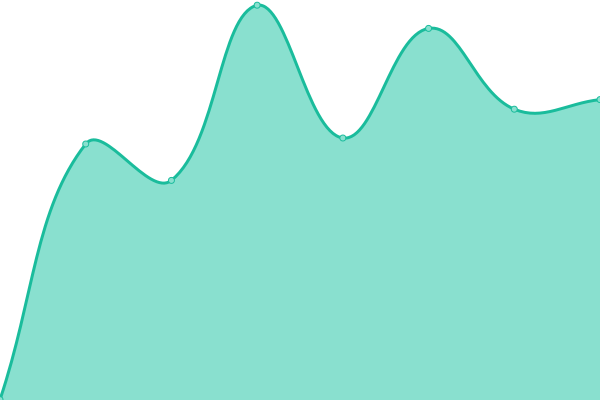

# [📈 Live Status](https://demo.upptime.js.org): <!--live status--> **🟩 All systems operational**

This repository contains the open-source uptime monitor and status page for [Maxime Marinel](https://demo.upptime.js.org), powered by [Upptime](https://github.com/upptime/upptime).

With [Upptime](https://upptime.js.org), you can get your own unlimited and free uptime monitor and status page, powered entirely by a GitHub repository. We use [Issues](https://github.com/bourvill/upptime/issues) as incident reports, [Actions](https://github.com/bourvill/upptime/actions) as uptime monitors, and [Pages](https://demo.upptime.js.org) for the status page.

<!--start: status pages-->
<!-- This summary is generated by Upptime (https://github.com/upptime/upptime) -->
<!-- Do not edit this manually, your changes will be overwritten -->
<!-- prettier-ignore -->
| URL | Status | History | Response Time | Uptime |
| --- | ------ | ------- | ------------- | ------ |
|  [Mazout](https://mazout.info) | 🟩 Up | [mazout.yml](https://github.com/bourvill/upptime/commits/HEAD/history/mazout.yml) | 

 582ms
     
 | 

<a href="https://bourvill.github.io/upptime/history/mazout">99.85%</a>
    

|  [Mazout API](https://api.mazout.info/v2) | 🟩 Up | [mazout-api.yml](https://github.com/bourvill/upptime/commits/HEAD/history/mazout-api.yml) | 

 713ms
     
 | 

<a href="https://bourvill.github.io/upptime/history/mazout-api">99.65%</a>
    

|  [District Web](https://www.district-web.fr) | 🟩 Up | [district-web.yml](https://github.com/bourvill/upptime/commits/HEAD/history/district-web.yml) | 

 948ms
     
 | 

<a href="https://bourvill.github.io/upptime/history/district-web">100.00%</a>
    

|  [Mailledesign](https://www.mailledesign.fr) | 🟩 Up | [mailledesign.yml](https://github.com/bourvill/upptime/commits/HEAD/history/mailledesign.yml) | 

 3390ms
     
 | 

<a href="https://bourvill.github.io/upptime/history/mailledesign">100.00%</a>
    

<!--end: status pages-->

[**Visit our status website →**](https://demo.upptime.js.org)

## 📄 License

- Powered by: [Upptime](https://github.com/upptime/upptime)
- Code: [MIT](./LICENSE) © [Maxime Marinel](https://demo.upptime.js.org)
- Data in the `./history` directory: [Open Database License](https://opendatacommons.org/licenses/odbl/1-0/)
